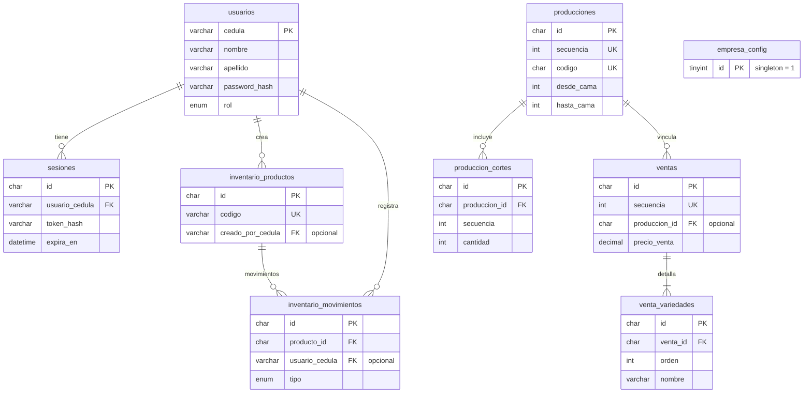

# Relaciones de base de datos — AgroApp / Turpial Dorado

Esquema MySQL 8 (Clever Cloud). Las llaves foráneas ya están en `turpial_dorado_clevercloud.sql`. Si importaste tablas sin FK, usa `aplicar_relaciones.sql`.

## Diagrama entidad-relación

## Tabla de relaciones (FK)

| Tabla hija | Columna | Tabla padre | Columna padre | Cardinalidad | ON DELETE | ON UPDATE |
|------------|---------|-------------|---------------|--------------|-----------|-----------|
| `sesiones` | `usuario_cedula` | `usuarios` | `cedula` | N → 1 | CASCADE | CASCADE |
| `produccion_cortes` | `produccion_id` | `producciones` | `id` | N → 1 | CASCADE | CASCADE |
| `ventas` | `produccion_id` | `producciones` | `id` | 0..N → 1 | SET NULL | CASCADE |
| `venta_variedades` | `venta_id` | `ventas` | `id` | N → 1 | CASCADE | CASCADE |
| `inventario_productos` | `creado_por_cedula` | `usuarios` | `cedula` | 0..N → 1 | SET NULL | CASCADE |
| `inventario_movimientos` | `producto_id` | `inventario_productos` | `id` | N → 1 | RESTRICT | CASCADE |
| `inventario_movimientos` | `usuario_cedula` | `usuarios` | `cedula` | 0..N → 1 | SET NULL | CASCADE |

## Tablas sin relación FK

| Tabla | Motivo |
|-------|--------|
| `empresa_config` | Configuración global (1 fila, `id = 1`). No referencia otras tablas. |
| `producciones` | Entidad raíz del módulo producción. |

## Vistas (dependen de tablas)

| Vista | Origen |
|-------|--------|
| `v_producciones_activas` | `producciones` WHERE `finalizada = 0` |
| `v_producciones_historial` | `producciones` WHERE `finalizada = 1` |
| `v_ventas_activas` | `ventas` WHERE `pago_confirmado = 0` |
| `v_ventas_historial` | `ventas` WHERE `pago_confirmado = 1` |
| `v_inventario_stock` | `inventario_productos` ordenado por categoría |

## Módulos del proyecto ↔ tablas

| Módulo frontend | Tablas |
|-----------------|--------|
| Auth / Perfil | `usuarios`, `sesiones` |
| Empresa / branding | `empresa_config` |
| Producción | `producciones`, `produccion_cortes` |
| Ventas | `ventas`, `venta_variedades` |
| Inventario | `inventario_productos`, `inventario_movimientos` |

## Archivos

- `turpial_dorado_clevercloud.sql` — esquema completo + datos iniciales
- `aplicar_relaciones.sql` — solo llaves foráneas (re-aplicar en Clever Cloud)
- `agroapp_er.svg` — diagrama visual (generar con `python generate_er_diagram.py`)
